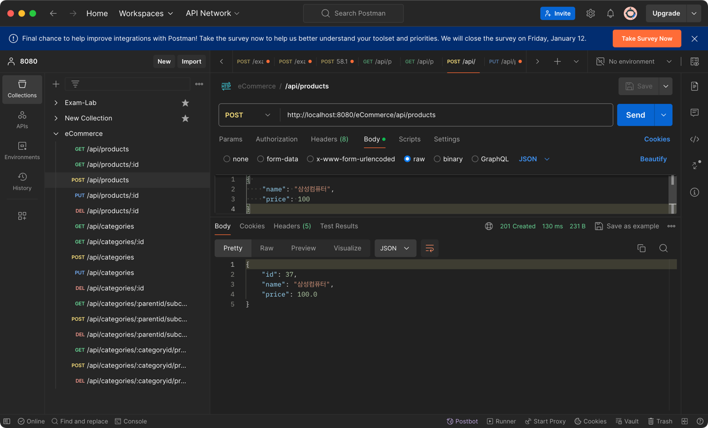

# eCommerce

<!-- TOC -->
* [eCommerce](#ecommerce)
* [데이터 베이스 초기화](#데이터-베이스-초기화)
* [설정파일](#설정파일)
* [컨트롤러 파일](#컨트롤러-파일)
* [Rest API](#rest-api)
  * [Products:](#products)
    * [1) Get, http://localhost:8080/eCommerce/api/products](#1-get-httplocalhost8080ecommerceapiproducts)
    * [2) Get, http://localhost:8080/eCommerce/api/products/1](#2-get-httplocalhost8080ecommerceapiproducts1)
    * [3) Post, http://localhost:8080/eCommerce/api/products](#3-post-httplocalhost8080ecommerceapiproducts)
    * [4) Put, http://localhost:8080/eCommerce/api/products/37](#4-put-httplocalhost8080ecommerceapiproducts37)
    * [5) Delete, http://localhost:8080/eCommerce/api/products/37](#5-delete-httplocalhost8080ecommerceapiproducts37)
  * [Category:](#category)
    * [1-1) Get, http://localhost:8080/eCommerce/api/categories](#1-1-get-httplocalhost8080ecommerceapicategories)
    * [1-2) Get, http://localhost:8080/eCommerce/api/categories/1](#1-2-get-httplocalhost8080ecommerceapicategories1)
    * [1-3) Post, http://localhost:8080/eCommerce/api/categories](#1-3-post-httplocalhost8080ecommerceapicategories)
    * [1-4) Put, http://localhost:8080/eCommerce/api/categories/18](#1-4-put-httplocalhost8080ecommerceapicategories18)
    * [1-5) Delete, http://localhost:8080/eCommerce/api/categories/18](#1-5-delete-httplocalhost8080ecommerceapicategories18)
    * [2-1) Get, http://localhost:8080/eCommerce/api/categories/1/products](#2-1-get-httplocalhost8080ecommerceapicategories1products)
    * [2-2) Post, http://localhost:8080/eCommerce/api/categories/1/subcategories/19](#2-2-post-httplocalhost8080ecommerceapicategories1subcategories19)
    * [2-3) Get, http://localhost:8080/eCommerce/api/categories/1](#2-3-get-httplocalhost8080ecommerceapicategories1)
    * [2-4) Delete, http://localhost:8080/eCommerce/api/categories/1/subcategories/19](#2-4-delete-httplocalhost8080ecommerceapicategories1subcategories19)
    * [3-1) Get, http://localhost:8080/eCommerce/api/categories/8/products](#3-1-get-httplocalhost8080ecommerceapicategories8products)
    * [3-2) Post, http://localhost:8080/eCommerce/api/categories/8/products/38](#3-2-post-httplocalhost8080ecommerceapicategories8products38)
    * [3-3) Delete, http://localhost:8080/eCommerce/api/categories/8/products/38](#3-3-delete-httplocalhost8080ecommerceapicategories8products38)
    * [3-4) Get, http://localhost:8080/eCommerce/api/categories/8/products](#3-4-get-httplocalhost8080ecommerceapicategories8products)
<!-- TOC -->

# 데이터 베이스 초기화


# 설정파일

dao-context.xml
```xml
<context:component-scan base-package="kr.ac.hansung.cse.dao" />
```

service-context.xml
```xml
<context:component-scan base-package="kr.ac.hansung.cse.service" />
```

servlert-context.xml
```xml
<context:component-scan base-package="kr.ac.hansung.cse.controller" />
```

# 컨트롤러 파일

ProductController.java
```java
@PutMapping("/{id}")
public ResponseEntity<Product> updateProduct(@PathVariable Long id, @Valid @RequestBody ProductDto request) {
    Product product = productService.getProductById(id);
    if (product == null) {
        throw new NotFoundException(id);
    }

    product.setName(request.getName());
    product.setPrice(request.getPrice());

    productService.updateProduct(product);
    return ResponseEntity.ok(product);
}
```

CategoryController.java
```java
@GetMapping("/{id}")
public ResponseEntity<Category> retrieveCategory(@PathVariable Long id) {
    Category category = categoryService.getCategoryById(id);
    if (category == null) {
        return ResponseEntity.notFound().build();
    }
    return ResponseEntity.ok(category);
}
```

CategoryProductsController.java
```java
@DeleteMapping("/{productId}")
public ResponseEntity<Void> removeProduct(@PathVariable Long categoryId, @PathVariable Long productId) {
    Category category = categoryService.getCategoryById(categoryId);
    if (category == null) {
        throw new NotFoundException(categoryId);
    }

    Product product = productService.getProductById(productId);
    if (product == null) {
        throw new NotFoundException(productId);
    }

    if (!productService.hasCategory(product, category)) {
        throw new IllegalArgumentException("Product " + productId + " doesn't contains category " + categoryId);
    }

    productService.removeCategory(product, category);
    return ResponseEntity.noContent().build();
}
```

# Rest API

## Products:
### 1) Get, http://localhost:8080/eCommerce/api/products


### 2) Get, http://localhost:8080/eCommerce/api/products/1


### 3) Post, http://localhost:8080/eCommerce/api/products


### 4) Put, http://localhost:8080/eCommerce/api/products/37


### 5) Delete, http://localhost:8080/eCommerce/api/products/37


## Category:
### 1-1) Get, http://localhost:8080/eCommerce/api/categories


### 1-2) Get, http://localhost:8080/eCommerce/api/categories/1


### 1-3) Post, http://localhost:8080/eCommerce/api/categories


### 1-4) Put, http://localhost:8080/eCommerce/api/categories/18


### 1-5) Delete, http://localhost:8080/eCommerce/api/categories/18


### 2-1) Get, http://localhost:8080/eCommerce/api/categories/1/products


### 2-2) Post, http://localhost:8080/eCommerce/api/categories/1/subcategories/19


### 2-3) Get, http://localhost:8080/eCommerce/api/categories/1


### 2-4) Delete, http://localhost:8080/eCommerce/api/categories/1/subcategories/19


### 3-1) Get, http://localhost:8080/eCommerce/api/categories/8/products


### 3-2) Post, http://localhost:8080/eCommerce/api/categories/8/products/38


### 3-3) Delete, http://localhost:8080/eCommerce/api/categories/8/products/38


### 3-4) Get, http://localhost:8080/eCommerce/api/categories/8/products
